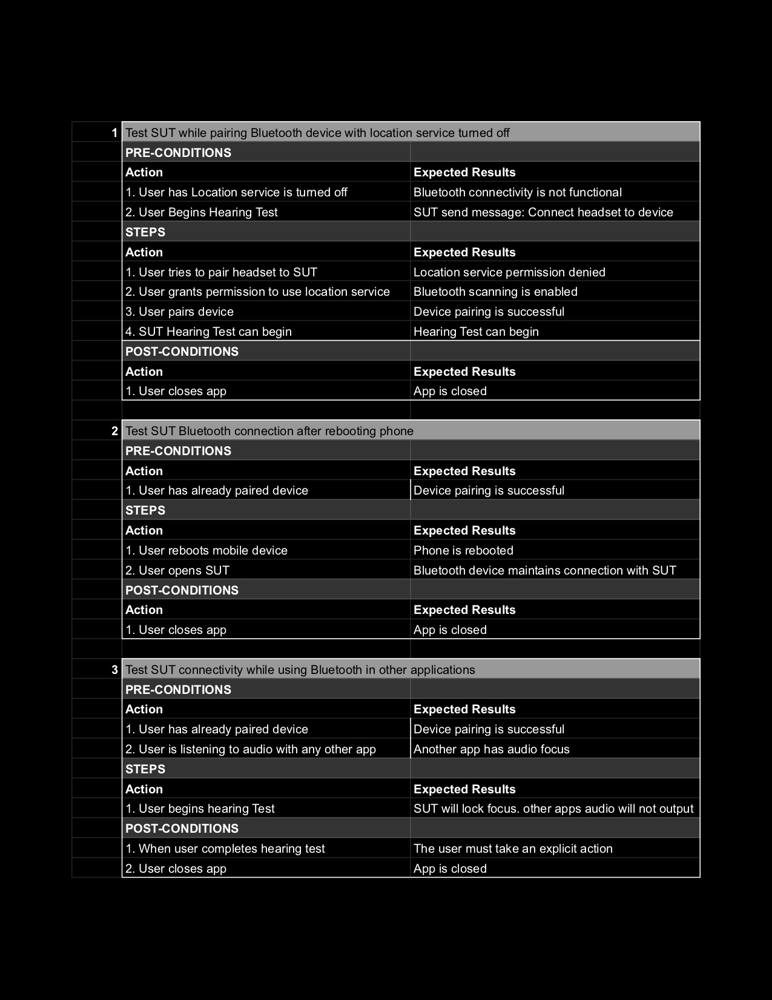
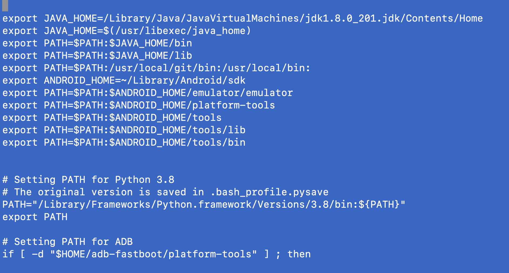

# Mimi Testing Challenge

## Objective

###  Task One:
 Design a test strategy for a mobile software hearing aid application. The three areas of potential instability that should be tested in detail are: Managing Audio Focus, Bluetooth Connectivity and Accessibility Support.  

* * *

* Managing Audio Focus

    This test plan will be performed in two parts. First exploratory testing and secondly automated regression test development and execution. The purpose of exploratory testing will be to identify risk and other areas that need coverage.

    During the risk assessment, audio output whether from the audio jack or via bluetooth will be recorded in an audio analyzer software to determine amplitude deviations, audio drop rate and ducking.

    The automated regression testing will provide validation for basic functionality and create an alert if any of the audio management functionality is failing. This will also create an opportunity for testing more devices.   

    * We will adhere to the Android developer guidelines during the hearing test as well as when accessing the audiogram for use with other applications and services (eg, Spotify, Youtube, Phone calls etc).

        * Check when another app gains audio focus, the SUT has stopped or paused playing, or duck the volume down.

        * Check when playback stops or abandons audio focus. However, if the user pauses playback abandoning audio focus is not required but may resume focus later.

        * Check for delayed focus gain which can occur when the system can't grant access because an app has "locked" focus, for example during a phone call. In this situation the SUT shall not output audio playback because it does not have focus. 

    * Responding to an audio focus change
         * In case of temporary loss of audio focus
        the SUT should duck or pause playing and maintain the same state. During a transient loss of audio focus, the SUT should continue to monitor changes in audio focus and be prepared to resume normal playback when the SUT regains the focus. When the blocking app abandons focus, The SUT can restore the volume to normal level or restart playback.

         * In case of permanent loss of audio focus
        the SUT should pause playback immediately. 
        To restart playback, the user must take an explicit action, like pressing the play transport control in a notification or app UI.

        * Check that the delayed stop does not suddenly start in if the user restarts playback, no volume jumping as this could be a painful experience for the user.
* * *

* Bluetooth Connectivity

    * This test will be a sequence of user interactions performed in the way people are expected to use the SUT. This will be the first round of the test and it will validate the expected behavior. Reliability is the focus and the main concern here is finding errors that deviate from the specifications. 

    * The steps taken here will be later translated into automatic regression test for CI/CD purposes. Emulators will be used to test and fake different states of the SUT. In addition, end to end functionality testing with a real device can help to identify false positives and ensure that the results are not affected by software setup or network performance. 

* Bluetooth Acceptance Test Examples

* * *

* Accessibility support

   * To verify that the SUT has proper accessibility support there will be an internal review or smoke test of the product so as to quickly discover any major or critical problems. 
   
   * A friendly user group will be gathered to put the SUT into service and communicate any changes that would be necessary or problem areas that have been discovered. In essence, a beta test group that is driven by a QA facilitator will help to ensure that the SUT accessibility features are implemented correctly.

    * Areas of focus:
        * Captions
            * Check that the Captions are accurate
        * Transcripts
            * Check that the transcripts are being used and following the captions
        * Audio quality
            * Check that the SUT tools for audio clarity work in different environments such has use with speech, use in noise, and use in wind 
            * Check that the SUT's has the correct mask for people with tinnitus 
        * Simple Yet Clear Language
            * Check the use of active voice
            * Check the use of slang words or jargon

* * *

### Task Two:
* Write a test suite for the Mimi Hearing Test App.
    Create at least 5 low-level test cases for the app.
    Automate at least 3 of the test cases.

### What is it?
This project consist of a procedurally written test suite utilizing the Appium library and Robot Framework. This is an automatic regression test suite running on an Android emulator. Test cases are written in the MimiTest.robot file. 

### Quick Video of the Test in action

### Getting Started 
Here are the prerequisites for running this testing framework.

### Step 1: Install Python 
Visit the following website to download Python software.

https://www.python.org/downloads/

Download the latest version for your operating system (eg: macOS)

### Step 2: Install Pip3
* Follow this link https://pip.pypa.io/en/stable/installation/ to download pip3 on your computer
* Follow the instructions on the page and then after successfully downloading Pip3, run `python3 get-pip.py` in your terminal
* This will install pip3 into your computer and then you can check the installation of pip3 by running `which pip3` in your terminal.

### Step 3: install requirements 
Open the Command-line interface (CLI) and navigate to the Mimi folder and run `pip3 install requirements.txt`

This command will install all the required software the project will use to run the test suite including robotframework, appium library, and more.  
 
### Step 4: Install Java 
https://tinyurl.com/ejwwaa5c

For the this particular test setup Java SE Runtime Environment (build 1.8.0_201-b09) was used as this version and build was very compatible with the uiautomatorviewer which was used to identify the resource-id on the SUT.

### Step 5: Install Android Studio
https://developer.android.com/

### Step 6: Set up bash_profile
    vi ~/.bash_profile
 

### Step 7: Create Emulator
* To accurately run this test a Pixel_3a_Android_11 emulator had to be created in Android Studio. Please use the following link for an overview on how to create and manage virtual devices: https://developer.android.com/studio/run/managing-avds

## Running the test
* There are a few steps to get this test running.
* Navigate to the MIMI directory with the CLI.
1. In a Terminal launch the emulator `./emulator @Pixel_3a_Android_11` or cd Library/Android/sdk/emulator and then run `./emulator @Pixel_3a_Android_11`
    * The emulator can also be launched from the android studio AVD Manager:
            Select Tools > AVD Manager.
            Click AVD Manager AVD Manager icon in the toolbar.

2. In a second terminal run `appium`. This will open the appium server.

3. In a third terminal run the robot test suite using the following commands:

    `robot -d Results -N "Full Regression" Tests` 

        Full Regression, this will run all test suites and test cases
    
    `robot -d Results Tests/MimiTest.robot` 

        This will run all test cases within a single test

    `robot -d Results -i Smoke Tests` 

        This will run only the test step that has been tagged, in this case only the Smoke test will run

### Changing the tests and reports directories
It is possible to use different directories to read tests from and to generate reports too. This is useful when using a complex test file structure. 

Test reports are automatically generated to the Results folder by defining the location with '-d' in the robot run command:
    
    robot \
        -d Results Tests <log.html, output.xml, report.html will be generated in the Results folder>
        -d Reports Tests <logs are generated in a new folder titled 'Reports'> 
        

### Accessing the logs
The logs can be accessed by simply opening the report.html in any browser. The report file gives general information with searchable criteria about the test suite. In case further investigation is required, open the log.html file with a browser for a more detailed view of the test cases. The log file gives information about each step the test takes.

### Backlog
* Implement test for iOS
* Create a Docker image

